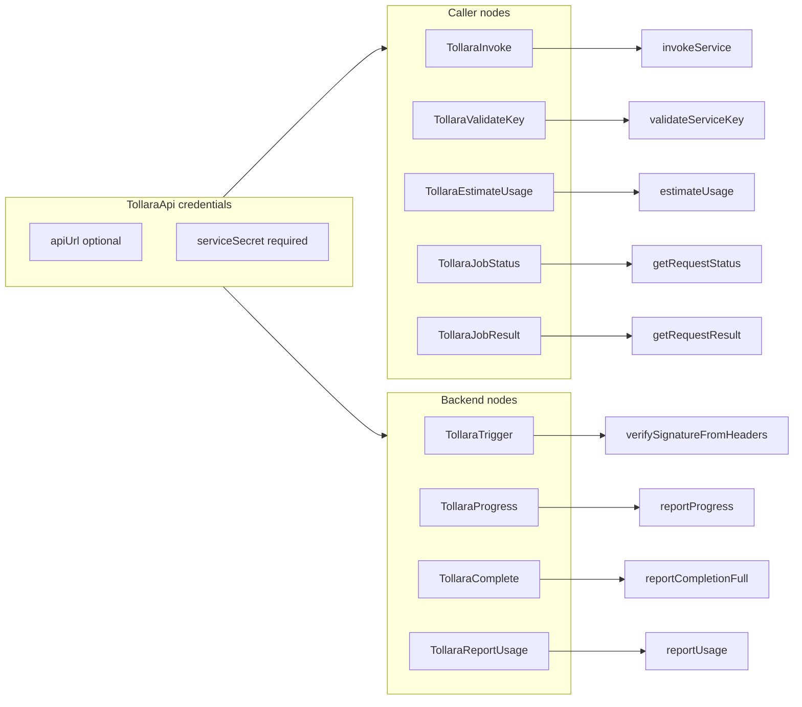

# Fix Tollara n8n Integration

## Decisions (from your answers)

| Topic | Decision |
|-------|----------|
| SDK dependency | `"@tollara/service-sdk": "^0.0.1"` from npm (published; no `file:../sdk-js`) |
| Icons | Copy [`tollara_icon_transparent.png`](C:/Work/Mat/agent-hub/frontend/public/brand/tollara_icon_transparent.png) into repo; all nodes use `icon: 'file:tollara.png'` |
| Invoke output | Richer shape (`statusCode`, `body`, `data`, async fields) — OK, no users |
| Package version | Stay **`0.0.1`** (no bump to 0.1.0) |

## Architecture



## 1. Dependency and CI

**[`integration-n8n/package.json`](integration-n8n/package.json)**

- Replace `"@tollara/service-sdk": "file:../sdk-js"` with `"@tollara/service-sdk": "^0.0.1"`
- Keep package version **`0.0.1`**
- Extend `build` script to copy icons after `tsc` (see section 2)
- Register 4 new nodes in `n8n.nodes`
- Update `description` to list all 9 nodes

**CI — [`.github/workflows/ci.yml`](.github/workflows/ci.yml)**

- `integration-n8n` job: remove `needs: [sdk-js]` and the `sdk-js` build step; install and build from npm only:
  ```yaml
  - run: cd integration-n8n && npm install && npm run build
  ```
- Generate and commit `integration-n8n/package-lock.json` (repo has no lockfiles today; `npm ci` currently cannot work)

**[`integration-n8n/README.md`](integration-n8n/README.md)** — remove “build sdk-js first” as a hard requirement; note SDK is installed from npm.

## 2. Icons

n8n resolves `file:tollara.png` relative to each compiled node in `dist/nodes/<NodeName>/`. TypeScript does not copy assets.

- Add committed asset: [`integration-n8n/assets/tollara.png`](integration-n8n/assets/tollara.png) (copy from your brand file)
- Add small post-build script [`integration-n8n/scripts/copy-icons.mjs`](integration-n8n/scripts/copy-icons.mjs) that copies `assets/tollara.png` into every `dist/nodes/*/` directory
- Update `build`: `"build": "tsc && node scripts/copy-icons.mjs"`
- Change all node `icon` fields from `file:tollara.svg` → `file:tollara.png` (existing 5 + 4 new)

## 3. Unify credentials

**Edit [`integration-n8n/credentials/TollaraApi.credentials.ts`](integration-n8n/credentials/TollaraApi.credentials.ts)**

- Remove `gatewayUrl`
- `apiUrl`: optional, default `''`, placeholder `https://api.tollara.ai`, description “leave blank for production”

**Add [`integration-n8n/lib/tollaraCredentials.ts`](integration-n8n/lib/tollaraCredentials.ts)**

```typescript
export function getTollaraCredentials(credentials: IDataObject): {
  apiUrl: string | undefined;
  serviceSecret: string;
}
```

Blank/whitespace `apiUrl` → `undefined` so SDK falls back to `https://api.tollara.ai`.

**Edit [`integration-n8n/tsconfig.json`](integration-n8n/tsconfig.json)** — add `"lib/**/*.ts"` to `include`.

## 4. Refactor Tollara Invoke

**Edit [`integration-n8n/nodes/TollaraInvoke/TollaraInvoke.node.ts`](integration-n8n/nodes/TollaraInvoke/TollaraInvoke.node.ts)**

Replace raw `fetch` + `gatewayUrl` with `invokeService` from `@tollara/service-sdk`.

New parameters:

- HTTP Method: GET | POST | PUT | DELETE (default POST)
- Async: boolean (default false)
- Existing: Service Key, Service ID, Endpoint ID, Body

Output:

```json
{ "statusCode", "body", "data", "requestId", "callbackUrl", "progressUrl" }
```

- Map `asyncEnvelope` when status is 202
- Parse JSON `body` into `data` when valid

## 5. Add four nodes

One folder per node, same patterns as existing nodes (`transform` group, `tollaraApi` credential, `tollara.png` icon).

| Node | SDK call | Key parameters |
|------|----------|----------------|
| **TollaraJobStatus** | `getRequestStatus` | Service Key, Request ID |
| **TollaraJobResult** | `getRequestResult` | Service Key, Request ID |
| **TollaraReportUsage** | `reportUsage` | User ID, Service ID, Units Used |
| **TollaraEstimateUsage** | `estimateUsage` | Service Key, Service ID (optional), Estimated Units |

Polling nodes output: `{ statusCode, ok, body, data }` (map SDK `status` → `statusCode`).

Report/Estimate: spread SDK result fields into JSON output; handle `null` from estimate with a clear node error.

Optional small shared helper in `lib/parseJsonBody.ts` for JSON parse used by Invoke + polling nodes (avoids duplication).

## 6. Touch existing nodes (minimal)

| Node | Change |
|------|--------|
| TollaraTrigger | `getTollaraCredentials` for `serviceSecret` only |
| TollaraValidateKey | helper + `baseUrl: apiUrl` |
| TollaraProgress | helper for `serviceSecret`; keep full `progressUrl` param |
| TollaraComplete | helper for `serviceSecret`; keep full `callbackUrl` param |

## 7. README

Update [`integration-n8n/README.md`](integration-n8n/README.md):

- Credentials: Service Secret (required) + API URL (optional, blank = production)
- List all 9 nodes; remove stale Gateway/Core/Usage URL references
- Example flows: async caller (`Invoke → Job Status → Job Result`) and backend (`Trigger → Progress → Complete`)
- Install: `npm install && npm run build` (no local sdk-js build)

## Out of scope (unchanged)

- sdk-js source changes
- JWT usage estimate, SSE streaming, path-prefix overrides
- integration-openclaw

## Verification

```powershell
cd integration-n8n
npm install
npm run build
```

Confirm `dist/nodes/*/tollara.png` exists for all 9 nodes and TypeScript compiles cleanly.
