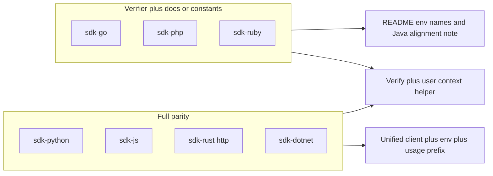

# Cross-SDK parity with sdk-java (and tests)

## Reference behavior (source of truth)

Mirror semantics from:

- `[sdk-java/src/main/java/com/agentvend/client/AgentVendClient.java](sdk-java/src/main/java/com/agentvend/client/AgentVendClient.java)` — `AGENTVEND_API_URL`, `AGENTVEND_AGENT_ID`, `AGENTVEND_AGENT_SECRET`, default prefixes (`/api/v1`, `/api`, `/api/usage`), optional `coreApiUrl` / `gatewayApiUrl` / `usageApiUrl`, builder explicit values **override** env.
- `[sdk-java/src/main/java/com/agentvend/client/UsageServiceClient.java](sdk-java/src/main/java/com/agentvend/client/UsageServiceClient.java)` — report URL `{usageBase}{usagePathPrefix}/report` with default prefix `/api/usage`.
- `[sdk-java/src/main/java/com/agentvend/client/AgentVendRequestVerifier.java](sdk-java/src/main/java/com/agentvend/client/AgentVendRequestVerifier.java)` — `verifyInboundHmacAndGetUserContext` → empty/absent when invalid, trusted context only when valid.

## SDK tiers (what to implement)

### Tier 1 — Full HTTP parity (unified client + usage prefix + verify helper)

| SDK                      | Existing HTTP surface                                                                                                                                                                                                                                                          | Implementation sketch                                                                                                                                                                                                                                                                                                                                                                           |
| ------------------------ | ------------------------------------------------------------------------------------------------------------------------------------------------------------------------------------------------------------------------------------------------------------------------------ | ----------------------------------------------------------------------------------------------------------------------------------------------------------------------------------------------------------------------------------------------------------------------------------------------------------------------------------------------------------------------------------------------- |
| [sdk-python](sdk-python) | `[validation_client.py](sdk-python/src/agentvend_agent_sdk/validation_client.py)`, `[usage_client.py](sdk-python/src/agentvend_agent_sdk/usage_client.py)` (`/api/usage/report` hard-coded ~L185), `[gateway_client.py](sdk-python/src/agentvend_agent_sdk/gateway_client.py)` | New `client.py` (or `agent_vend_client.py`) with `AgentVendClient` / `from_env()` reading `os.environ`; compose URLs like Java’s `[AgentVendUrls](sdk-java/src/main/java/com/agentvend/client/AgentVendUrls.java)`; extend `report_usage_at` (and callers) with `usage_path_prefix` defaulting to `/api/usage`; re-export from `[__init__.py](sdk-python/src/agentvend_agent_sdk/__init__.py)`. |
| [sdk-js](sdk-js)         | `[validationClient.ts](sdk-js/src/validationClient.ts)`, `[usageClient.ts](sdk-js/src/usageClient.ts)`, `[gatewayClient.ts](sdk-js/src/gatewayClient.ts)`                                                                                                                      | New `agentVendClient.ts` exporting `createAgentVendClient(options)` (or class) with `process.env.AGENTVEND_*` when fields omitted; same URL rules; `reportUsage` params gain optional `usagePathPrefix`; wire `[index.ts](sdk-js/src/index.ts)`.                                                                                                                                                |
| [sdk-rust](sdk-rust)     | `[validation_client.rs](sdk-rust/src/validation_client.rs)`, `[usage_client.rs](sdk-rust/src/usage_client.rs)`, `[gateway_client.rs](sdk-rust/src/gateway_client.rs)` behind `feature = "http"`                                                                                | New `agent_vend_client.rs` (same feature gate): struct + builder, `std::env::var` for the three names, defaults for path prefixes; add `usage_path_prefix` to `report_usage` path construction in `[usage_client.rs](sdk-rust/src/usage_client.rs)`; export from `[lib.rs](sdk-rust/src/lib.rs)`.                                                                                               |
| [sdk-dotnet](sdk-dotnet) | `[ValidationClient.cs](sdk-dotnet/ValidationClient.cs)`, `[UsageClient.cs](sdk-dotnet/UsageClient.cs)`, `[GatewayClient.cs](sdk-dotnet/GatewayClient.cs)`                                                                                                                      | New `AgentVendClient.cs` + options record: resolve from `Environment.GetEnvironmentVariable` when properties null/empty; same URL join rules; extend usage report URL builder with prefix; optional thin wrappers calling existing static/async methods.                                                                                                                                        |

### Tier 2 — Verifier-only SDKs (no HTTP clients in repo today)

| SDK                  | Files                                                               | Work                                                                                                                                                                                                                                                                                                        |
| -------------------- | ------------------------------------------------------------------- | ----------------------------------------------------------------------------------------------------------------------------------------------------------------------------------------------------------------------------------------------------------------------------------------------------------- |
| [sdk-go](sdk-go)     | `[hmac.go](sdk-go/hmac.go)` (+ inbound verify helpers)              | Add “verify + user context” in one API (e.g. return `(UserContext, bool)` or `(ctx, ok)` matching Go style). Export env **name constants** as `const` strings in a small `env.go` (or README only) so callers align with Java; **do not** invent HTTP clients unless product explicitly wants new packages. |
| [sdk-php](sdk-php)   | `[Verifier.php](sdk-php/src/Verifier.php)`                          | Add static method e.g. `verifyInboundHmacAndGetUserContext` returning `?array` or small value object: `null` if invalid, else same shape as `userContextFromHeaders`. Document `AGENTVEND_`* in `[sdk-php/README.md](sdk-php/README.md)`.                                                                   |
| [sdk-ruby](sdk-ruby) | `[lib/agentvend_agent_sdk.rb](sdk-ruby/lib/agentvend_agent_sdk.rb)` | Add `verify_signature_from_headers_and_user_context` (or shorter name) returning `nil` on failure, else hash like `user_context_from_headers`. Document env vars in `[sdk-ruby/README.md](sdk-ruby/README.md)`.                                                                                             |

## Inbound “verify + context” (all verifier-capable SDKs)

Add an API equivalent to Java’s `Optional<UserContext>` idiom:

- **Python**: `Optional[UserContext]` from `[verifier.py](sdk-python/src/agentvend_agent_sdk/verifier.py)`; export in `__init__.py`.
- **TypeScript**: `UserContext | null` or a small `{ ok: true, context } | { ok: false }` in `[verifier.ts](sdk-js/src/verifier.ts)`.
- **Rust**: `Option<UserContext>` in `[hmac.rs](sdk-rust/src/hmac.rs)` (or verifier module).
- **.NET**: `UserContext?` or `VerifyInboundResult` in `[Verifier.cs](sdk-dotnet/Verifier.cs)`.
- **Go / PHP / Ruby**: as above.

Reuse existing verify + context parsing logic to avoid double maintenance where possible (one function calls the other internally, same as Java).

## Test coverage (per SDK)

| Area                        | What to add                                                                                                                                                                                                                                                                                                                                                                                                                                                                                                                                                                                                                                                                                      |
| --------------------------- | ------------------------------------------------------------------------------------------------------------------------------------------------------------------------------------------------------------------------------------------------------------------------------------------------------------------------------------------------------------------------------------------------------------------------------------------------------------------------------------------------------------------------------------------------------------------------------------------------------------------------------------------------------------------------------------------------ |
| **Verify + context**        | Happy path: valid HMAC → non-empty context with expected fields. Failure: bad signature → empty/null. Mirror `[AgentVendRequestVerifierTest](sdk-java/src/test/java/com/agentvend/client/AgentVendRequestVerifierTest.java)` patterns.                                                                                                                                                                                                                                                                                                                                                                                                                                                           |
| **Unified client (Tier 1)** | **Build validation**: missing API URL and env → error; missing secret → error; optional agent id omitted → still builds. **Integration-style** (match `[AgentVendClientIntegrationTest](sdk-java/src/test/java/com/agentvend/client/AgentVendClientIntegrationTest.java)`): one origin, stub `GET .../api/requests/.../status`, `POST .../api/usage/report`; optional second case with custom usage prefix `/usage/api/v1/report`. Use ecosystem tools: Python `pytest` + `responses`/`httpx` mock or local HTTP server; JS existing test runner + `fetch` mock; Rust `wiremock` dev-dep or `tokio::test` with mock server; .NET `HttpMessageHandler` fake or WireMock.Net if already justified. |
| **Usage path prefix**       | At least one test that asserts final URL path when prefix is non-default (can be unit-level with mocked transport).                                                                                                                                                                                                                                                                                                                                                                                                                                                                                                                                                                              |

## CI / automation

- `[.github/workflows/ci.yml](.github/workflows/ci.yml)`: extend **sdk-python** beyond one-liner HMAC smoke test → `pytest` (or `python -m pytest`) for `sdk-python/tests/`.
- **sdk-rust**: add `cargo test` (at least default features; optionally `--features http` if CI installs deps) so new tests run in CI.
- **sdk-js**, **sdk-dotnet**: ensure `npm test` / `dotnet test` include new files (already partially present).

## Documentation

- Per SDK README: same **three env vars**, **default path prefixes**, **builder/options overrides env**, **split base URLs** (Tier 1), and **verify-and-context** example (idiomatic types, no `var` where README shows Java-style clarity).
- Optional: one line in `[docs/sdk-api-spec.md](docs/sdk-api-spec.md)` or `[docs/sdk-callers-and-backends.md](docs/sdk-callers-and-backends.md)` pointing readers to “unified client” naming per language.

## Out of scope / explicit non-goals

- **integration-n8n** and other integrations: not language SDKs; handle in a separate pass if needed.
- **sdk-go full HTTP client**: not in repo today; Tier 2 only unless you decide to add a new Go HTTP module.

## Suggested implementation order

1. **Verifier convenience** across all SDKs (small, consistent, easy to test).
2. **Usage path prefix** in Python / JS / Rust / .NET (localized change).
3. **Unified client + env** in each Tier 1 SDK + integration tests.
4. **CI** updates for Python + Rust tests.

