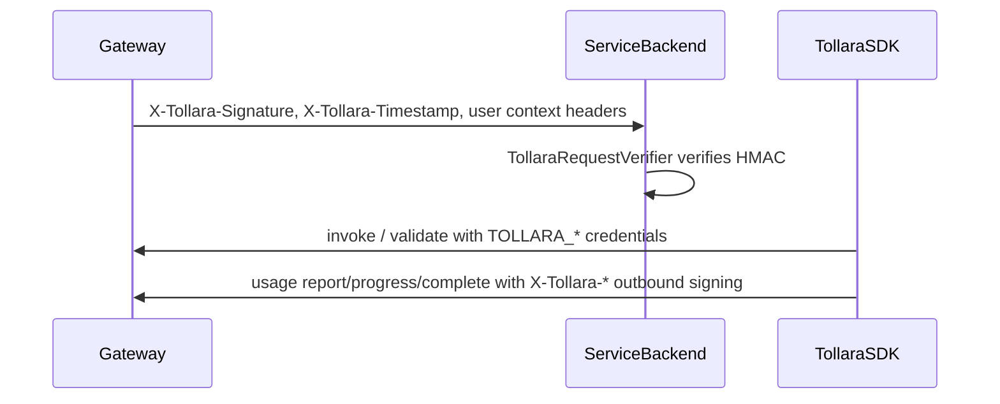

# Rebrand AgentVend to Tollara

## Your decisions (locked in)

| Topic | Choice |
|-------|--------|
| Wire contract | **Full rename** — `X-Tollara-*`, `TOLLARA_*` (no dual support) |
| Default API origin | **`https://api.tollara.ai`** |
| Registries | **New Tollara packages**; deprecate old AgentVend IDs (clean break) |
| Scope | **SDK + platform** released together |

---

## Naming conventions (mirror prior AgentVend rules)

| Layer | Old | New |
|-------|-----|-----|
| Product / docs | AgentVend | **Tollara** |
| Package prefix | `agentvend` | **`tollara`** |
| Types / classes | `AgentVendClient`, `AgentVendHeaders`, … | **`TollaraClient`**, **`TollaraHeaders`**, … |
| HTTP headers | `X-AgentVend-*` | **`X-Tollara-*`** |
| Env vars | `AGENTVEND_*` | **`TOLLARA_*`** (drop legacy `AGENTVEND_AGENT_*` aliases unless platform still needs them — prefer single canonical set) |
| Default URL | `https://api.agentvend.api` | **`https://api.tollara.ai`** |
| Marketing / support | `agentvend.ai`, `support@agentvend.ai` | **`tollara.ai`**, **`support@tollara.ai`** |

**Java reference:** [`AgentVendHeaders.java`](sdk-java/src/main/java/com/agentvend/client/AgentVendHeaders.java) becomes the template for all languages — one constants module per SDK.

---

## Published artifact mapping (new packages only)

| Ecosystem | Old ID | New ID |
|-----------|--------|--------|
| Maven | `com.agentvend:service-sdk` | **`com.tollara:service-sdk`** |
| npm | `@agentvend/service-sdk` | **`@tollara/service-sdk`** |
| NuGet | `AgentVend.ServiceSdk` | **`Tollara.ServiceSdk`** |
| PyPI | `agentvend-service-sdk` → `agentvend_service_sdk` | **`tollara-service-sdk`** → **`tollara_service_sdk`** |
| Go | `github.com/agentvend/service-sdk-go` | **`github.com/tollara/service-sdk-go`** |
| crates.io | `agentvend-service-sdk` | **`tollara-service-sdk`** |
| RubyGems | `agentvend_service_sdk` | **`tollara_service_sdk`** |
| Packagist | `agentvend/service-sdk` | **`tollara/service-sdk`** |
| n8n | `n8n-nodes-agentvend` | **`n8n-nodes-tollara`** |
| OpenClaw | `openclaw-agentvend` | **`openclaw-tollara`** |

**Registry prep (before first Tollara publish):** claim `com.tollara` on Sonatype, npm org `@tollara`, NuGet `Tollara.*`, PyPI/crates/Ruby/Packagist names, Go module path on GitHub.

**Deprecation:** mark old packages README-only / archived on registries; no further AgentVend releases after Tollara GA.

---

## Platform coordination (same release train)

Platform repos (gateway, core, usage) must ship **in lockstep** with SDKs:

**Platform checklist (outside this repo, tracked in platform PR):**

- Emit and validate **`X-Tollara-*`** on all signed paths (gateway → backend, core validate response, usage outbound).
- Update gateway default origin / DNS to **`api.tollara.ai`**.
- Rename internal env/config from `AGENTVEND_*` to **`TOLLARA_*`** in ECS/task defs and local dev templates.
- Update Cognito/branding strings, admin UI, and API docs on tollara.ai.
- **No backward compatibility** for `X-AgentVend-*` in production (per your choice).

**Spec source of truth:** update [`docs-sdk/MAIN-SDK-API-SPEC.md`](docs-sdk/MAIN-SDK-API-SPEC.md), [`docs/hmac-spec.md`](docs/hmac-spec.md), [`docs/api-overview.md`](docs/api-overview.md) — replace every `AgentVend` / `X-AgentVend` / `AGENTVEND` reference; refresh inline HMAC test vectors header names only (payloads unchanged).

---

## SDK monorepo execution order

Recommended sequence to avoid broken intermediate states:

1. **Docs + naming policy** — rewrite [`PACKAGE_NAME.md`](PACKAGE_NAME.md), root [`README.md`](README.md), [`.cursor/rules/project-overview.mdc`](.cursor/rules/project-overview.mdc), [`.cursor/rules/project-guidlines.mdc`](.cursor/rules/project-guidlines.mdc), [`.cursor/rules/sdk-coding-rules.mdc`](.cursor/rules/sdk-coding-rules.mdc) (remove AgentVend product references; keep “no internal URLs in public SDK READMEs” rule but for Tollara).
2. **Java first** (reference implementation per project rules) — mechanical rename, then fix tests:
   - Move `com/agentvend/**` → **`com/tollara/**`**
   - `groupId` / `group` → **`com.tollara`** in [`sdk-java/build.gradle`](sdk-java/build.gradle)
   - Classes: `AgentVendClient` → `TollaraClient`, `AgentVendRequestVerifier` → `TollaraRequestVerifier`, `AgentVendHeaders` → `TollaraHeaders`, etc.
   - Env: `AGENTVEND_*` → `TOLLARA_*` in client + tests
   - Default URL constant → `https://api.tollara.ai`
   - Update [`sdk-java/README.md`](sdk-java/README.md) install: `com.tollara:service-sdk`
3. **Mirror to other SDKs** (same public surface names):
   - **sdk-js:** `@tollara/service-sdk`; rename `agentVendClient.ts` → `tollaraClient.ts`; exports `TollaraClient`
   - **sdk-dotnet:** rename project/folder to `Tollara.ServiceSdk`; fix CI path (currently broken — points at non-existent `AgentVend.AgentSdk.Tests.csproj`); test project → `Tollara.ServiceSdk.Tests`
   - **sdk-python:** dir `agentvend_service_sdk` → `tollara_service_sdk`; `agentvend_headers.py` → `tollara_headers.py`
   - **sdk-go:** `go.mod` module path; `AgentVendClient` → `TollaraClient`; headers in `headers.go`
   - **sdk-rust:** crate name; `agent_vend_client.rs` → `tollara_client.rs`
   - **sdk-ruby:** gem + `lib/tollara_sdk.rb`; module `TollaraSdk`
   - **sdk-php:** namespace `Tollara\ServiceSdk`; Composer `tollara/service-sdk`
4. **Integrations**
   - **integration-n8n:** package `n8n-nodes-tollara`; node folders `TollaraInvoke`, etc.; credential `tollaraApi`; display names **Tollara**; dependency `@tollara/service-sdk`
   - **integration-openclaw:** `openclaw-tollara`; plugin id `tollara`; `skills/tollara/SKILL.md`
5. **CI** — [`.github/workflows/ci.yml`](.github/workflows/ci.yml): dotnet test path, any import smoke strings, job names optional (`sdk-java` can stay).
6. **CHANGELOG** — single major-version bump entry documenting breaking rename.
7. **Repo metadata** — rename GitHub repo to `tollara-sdk` (or org move); update SCM URLs in all `package.json` / `build.gradle` / `pyproject.toml` / gemspecs to `github.com/tollara/tollara-sdk` (confirm target org with you before merge).

**Public SDK READMEs:** user-facing only — **Tollara**, `TollaraClient`, install commands; no HMAC spec links, no `api.tollara.ai` override docs (per existing sdk-coding-rules).

---

## Mechanical rename strategy (~150 files)

Use scripted replace with review, in this order per language:

1. **String literals** — header names, env keys, default URL, emails, domains
2. **Identifiers** — class/type/function names (`AgentVend` → `Tollara`, `agentvend` → `tollara`, `agentVend` → `tollara` in filenames)
3. **Paths** — Java package dirs, Python package dir, n8n node folders, OpenClaw skill path
4. **Manifests** — `package.json`, `build.gradle`, `pyproject.toml`, `Cargo.toml`, `go.mod`, `composer.json`, gemspec, csproj
5. **Tests** — grep for leftover `AgentVend`, `agentvend`, `AGENTVEND`, `X-AgentVend`

**n8n breaking note:** internal node IDs (`agentvendInvoke` → `tollaraInvoke`) break existing workflows on upgrade — document in integration README and n8n changelog.

---

## Verification

| Check | Command / action |
|-------|------------------|
| No stale brand | repo-wide grep: `agentvend`, `AgentVend`, `AGENTVEND`, `X-AgentVend`, `agentvend.ai`, `api.agentvend.api` → **zero** (except CHANGELOG historical entry if desired) |
| Java | `.\gradlew.bat build` in `sdk-js` |
| JS | `npm ci && npm test` in `sdk-js` |
| .NET | `dotnet test Tollara.ServiceSdk.Tests` |
| Python | `pytest` |
| Go / Rust | `go test ./...`, `cargo test --features http` |
| Cross-language HMAC | run existing verifier tests; optionally add one shared vector file under `docs/` with `X-Tollara-*` labels |
| Integrations | build `integration-n8n`, `integration-openclaw` after sdk-js |
| Platform E2E | staging invoke + validate + async progress/complete with new headers |

---

## Risk summary

| Risk | Mitigation |
|------|------------|
| Customers on old SDK + new gateway | Coordinated GA; deprecation notices on old packages |
| Maven namespace `com.tollara` | Register before release |
| n8n workflow breakage | Major version bump + migration note |
| Missed header in one language | Java-first + grep gate in CI |
| Stale internal docs | Update `docs-sdk/` and `.cursor/rules` in same PR |

---

## Out of scope for SDK PR (but same release train)

- Main website / marketing copy on tollara.ai
- Database table renames (unless platform team includes in same migration)
- Historical `.cursor/plans/rebrand_to_agentvend_*.plan.md` — archive or leave as history
