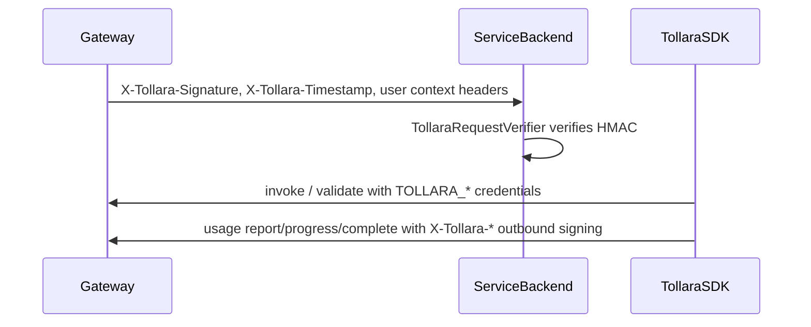

# Rebrand AgentVend to Tollara

## Goals

1. **Rebrand the product** from AgentVend.ai to Tollara.ai in all user-facing surfaces (public SDK READMEs, integration display names, package descriptions) without exposing internal API paths or HMAC implementation details.
2. **Ship a single, coordinated breaking release** of the SDK monorepo and platform (gateway, core, usage) so production traffic uses one wire contract: `X-Tollara-*` headers, `TOLLARA_*` environment variables, and default API origin `https://api.tollara.ai`.
3. **Publish new Tollara packages** on every registry (Maven, npm, NuGet, PyPI, Go, crates.io, RubyGems, Packagist, n8n, OpenClaw) and **deprecate** all `agentvend` / `AgentVend` artifacts — no dual-publish or backward-compatible header aliases.
4. **Preserve behavioral parity** with the current SDKs: same HMAC algorithms, canonical strings, and API flows; only names, constants, and package coordinates change.
5. **Keep Java as the reference implementation** and mirror renames consistently across all eight language SDKs plus n8n and OpenClaw integrations.
6. **Leave the repo internally consistent**: specs, `.cursor` rules, CI, CHANGELOG, licenses, and grep gates reflect Tollara with zero stale AgentVend / marketplace / agent-hub references (except explicitly archived historical plans).

---

## Your decisions (locked in)

| Topic | Choice |
|-------|--------|
| Wire contract | **Full rename** — `X-Tollara-*`, `TOLLARA_*` (no dual support) |
| Default API origin | **`https://api.tollara.ai`** |
| Registries | **New Tollara packages**; deprecate old AgentVend IDs (clean break) |
| Scope | **SDK + platform** released together |

---

## Naming conventions (mirror prior AgentVend rules)

| Layer | Old | New |
|-------|-----|-----|
| Product / docs | AgentVend | **Tollara** |
| Package prefix | `agentvend` | **`tollara`** |
| Types / classes | `AgentVendClient`, `AgentVendHeaders`, … | **`TollaraClient`**, **`TollaraHeaders`**, … |
| HTTP headers | `X-AgentVend-*` | **`X-Tollara-*`** |
| Env vars | `AGENTVEND_*` | **`TOLLARA_*`** (drop legacy `AGENTVEND_AGENT_*` aliases unless platform still needs them — prefer single canonical set) |
| Default URL | `https://api.agentvend.api` | **`https://api.tollara.ai`** |
| Marketing / support | `agentvend.ai`, `support@agentvend.ai` | **`tollara.ai`**, **`support@tollara.ai`** |

**Java reference:** [`AgentVendHeaders.java`](sdk-java/src/main/java/com/agentvend/client/AgentVendHeaders.java) becomes the template for all languages — one constants module per SDK.

---

## Published artifact mapping (new packages only)

| Ecosystem | Old ID | New ID |
|-----------|--------|--------|
| Maven | `com.agentvend:service-sdk` | **`com.tollara:service-sdk`** |
| npm | `@agentvend/service-sdk` | **`@tollara/service-sdk`** |
| NuGet | `AgentVend.ServiceSdk` | **`Tollara.ServiceSdk`** |
| PyPI | `agentvend-service-sdk` → `agentvend_service_sdk` | **`tollara-service-sdk`** → **`tollara_service_sdk`** |
| Go | `github.com/agentvend/service-sdk-go` | **`github.com/tollara/service-sdk-go`** |
| crates.io | `agentvend-service-sdk` | **`tollara-service-sdk`** |
| RubyGems | `agentvend_service_sdk` | **`tollara_service_sdk`** |
| Packagist | `agentvend/service-sdk` | **`tollara/service-sdk`** |
| n8n | `n8n-nodes-agentvend` | **`n8n-nodes-tollara`** |
| OpenClaw | `openclaw-agentvend` | **`openclaw-tollara`** |

**Registry prep (before first Tollara publish):** claim `com.tollara` on Sonatype, npm org `@tollara`, NuGet `Tollara.*`, PyPI/crates/Ruby/Packagist names, Go module path on GitHub.

**Deprecation:** mark old packages README-only / archived on registries; no further AgentVend releases after Tollara GA.

---

## Platform coordination (same release train)

Platform repos (gateway, core, usage) must ship **in lockstep** with SDKs:



**Platform checklist (outside this repo, tracked in platform PR):**

- Emit and validate **`X-Tollara-*`** on all signed paths (gateway → backend, core validate response, usage outbound).
- Update gateway default origin / DNS to **`api.tollara.ai`**.
- Rename internal env/config from `AGENTVEND_*` to **`TOLLARA_*`** in ECS/task defs and local dev templates.
- Update Cognito/branding strings, admin UI, and API docs on tollara.ai.
- **No backward compatibility** for `X-AgentVend-*` in production (per your choice).

**Spec source of truth:** update [`docs-sdk/MAIN-SDK-API-SPEC.md`](docs-sdk/MAIN-SDK-API-SPEC.md), [`docs/hmac-spec.md`](docs/hmac-spec.md), [`docs/api-overview.md`](docs/api-overview.md) — replace every `AgentVend` / `X-AgentVend` / `AGENTVEND` reference; refresh inline HMAC test vectors header names only (payloads unchanged).

---

## SDK monorepo execution order

Recommended sequence to avoid broken intermediate states:

1. **Docs + naming policy** — rewrite [`PACKAGE_NAME.md`](PACKAGE_NAME.md), root [`README.md`](README.md), [`.cursor/rules/project-overview.mdc`](.cursor/rules/project-overview.mdc), [`.cursor/rules/project-guidlines.mdc`](.cursor/rules/project-guidlines.mdc), [`.cursor/rules/sdk-coding-rules.mdc`](.cursor/rules/sdk-coding-rules.mdc) (remove AgentVend product references; keep “no internal URLs in public SDK READMEs” rule but for Tollara).
2. **Java first** (reference implementation per project rules) — mechanical rename, then fix tests:
   - Move `com/agentvend/**` → **`com/tollara/**`**
   - `groupId` / `group` → **`com.tollara`** in [`sdk-java/build.gradle`](sdk-java/build.gradle)
   - Classes: `AgentVendClient` → `TollaraClient`, `AgentVendRequestVerifier` → `TollaraRequestVerifier`, `AgentVendHeaders` → `TollaraHeaders`, etc.
   - Env: `AGENTVEND_*` → `TOLLARA_*` in client + tests
   - Default URL constant → `https://api.tollara.ai`
   - Update [`sdk-java/README.md`](sdk-java/README.md) install: `com.tollara:service-sdk`
3. **Mirror to other SDKs** (same public surface names):
   - **sdk-js:** `@tollara/service-sdk`; rename `agentVendClient.ts` → `tollaraClient.ts`; exports `TollaraClient`
   - **sdk-dotnet:** rename project/folder to `Tollara.ServiceSdk`; fix CI path (currently broken — points at non-existent `AgentVend.AgentSdk.Tests.csproj`); test project → `Tollara.ServiceSdk.Tests`
   - **sdk-python:** dir `agentvend_service_sdk` → `tollara_service_sdk`; `agentvend_headers.py` → `tollara_headers.py`
   - **sdk-go:** `go.mod` module path; `AgentVendClient` → `TollaraClient`; headers in `headers.go`
   - **sdk-rust:** crate name; `agent_vend_client.rs` → `tollara_client.rs`
   - **sdk-ruby:** gem + `lib/tollara_sdk.rb`; module `TollaraSdk`
   - **sdk-php:** namespace `Tollara\ServiceSdk`; Composer `tollara/service-sdk`
4. **Integrations**
   - **integration-n8n:** package `n8n-nodes-tollara`; node folders `TollaraInvoke`, etc.; credential `tollaraApi`; display names **Tollara**; dependency `@tollara/service-sdk`
   - **integration-openclaw:** `openclaw-tollara`; plugin id `tollara`; `skills/tollara/SKILL.md`
5. **CI** — [`.github/workflows/ci.yml`](.github/workflows/ci.yml): dotnet test path, any import smoke strings, job names optional (`sdk-java` can stay).
6. **CHANGELOG** — single major-version bump entry documenting breaking rename.
7. **Repo metadata** — rename GitHub repo to `tollara-sdk` (or org move); update SCM URLs in all `package.json` / `build.gradle` / `pyproject.toml` / gemspecs to `github.com/tollara/tollara-sdk` (confirm target org with you before merge).

**Public SDK READMEs:** user-facing only — **Tollara**, `TollaraClient`, install commands; no HMAC spec links, no `api.tollara.ai` override docs (per existing sdk-coding-rules).

---

## Mechanical rename strategy (~150 files)

Use scripted replace with review, in this order per language:

1. **String literals** — header names, env keys, default URL, emails, domains
2. **Identifiers** — class/type/function names (`AgentVend` → `Tollara`, `agentvend` → `tollara`, `agentVend` → `tollara` in filenames)
3. **Paths** — Java package dirs, Python package dir, n8n node folders, OpenClaw skill path
4. **Manifests** — `package.json`, `build.gradle`, `pyproject.toml`, `Cargo.toml`, `go.mod`, `composer.json`, gemspec, csproj
5. **Tests** — grep for leftover `AgentVend`, `agentvend`, `AGENTVEND`, `X-AgentVend`

**n8n breaking note:** internal node IDs (`agentvendInvoke` → `tollaraInvoke`) break existing workflows on upgrade — document in integration README and n8n changelog.

---

## Verification

| Check | Command / action |
|-------|------------------|
| No stale brand | repo-wide grep: `agentvend`, `AgentVend`, `AGENTVEND`, `X-AgentVend`, `agentvend.ai`, `api.agentvend.api` → **zero** (except CHANGELOG historical entry if desired) |
| Java | `.\gradlew.bat build` in `sdk-java` |
| JS | `npm ci && npm test` in `sdk-js` |
| .NET | `dotnet test Tollara.ServiceSdk.Tests` |
| Python | `pytest` |
| Go / Rust | `go test ./...`, `cargo test --features http` |
| Cross-language HMAC | run existing verifier tests; optionally add one shared vector file under `docs/` with `X-Tollara-*` labels |
| Integrations | build `integration-n8n`, `integration-openclaw` after sdk-js |
| Platform E2E | staging invoke + validate + async progress/complete with new headers |

---

## Risk summary

| Risk | Mitigation |
|------|------------|
| Customers on old SDK + new gateway | Coordinated GA; deprecation notices on old packages |
| Maven namespace `com.tollara` | Register before release |
| n8n workflow breakage | Major version bump + migration note |
| Missed header in one language | Java-first + grep gate in CI |
| Stale internal docs | Update `docs-sdk/` and `.cursor/rules` in same PR |

---

## Gaps filled in from [rebrand_to_agentvend plan](.cursor/plans/rebrand_to_agentvend_4391a355.plan.md)

Compared to the prior marketplace → AgentVend rebrand, the following were **missing or under-specified** in the first Tollara draft and are now in scope:

### Java (sdk-java) — file-level detail

- Rename **all** `com.agentvend.*` types, not only the unified client:
  - `TollaraUrls` (was `AgentVendUrls`), `TollaraHttpException`, `GatewayHmacUserContext`, `ServiceKeyValidationClient`, `UsageServiceClient`, `GatewayClient`, `GatewayInvokeClient`, model package under `com.tollara.client.model`
- Header constants in **every** client that signs or reads headers (validation, usage, gateway invoke, verifier tests)
- [`sdk-java/settings.gradle`](sdk-java/settings.gradle): `rootProject.name` still `agent-sdk` → e.g. `tollara-service-sdk`
- Maven publish metadata: `mavenCentralNamespace`, POM `name`/`description`, developer email, SCM URLs ([`build.gradle`](sdk-java/build.gradle), [`docs/maven-central-java-sdk-publishing.md`](docs/maven-central-java-sdk-publishing.md))

### JavaScript (sdk-js)

- Rename **all** source modules that reference headers: `verifier.ts`, `usageClient.ts`, `validationClient.ts`, `gatewayClient.ts`, `constants.ts`, `urls.ts` (not only `agentVendClient.ts`)
- Export env constants: `ENV_*` / `TOLLARA_*` on `TollaraClient` (including removal of legacy `AGENTVEND_AGENT_*` aliases per your decision)
- `package.json`: **keywords** — remove `agentvend`, add `tollara`; update `repository` / `homepage` URLs
- All `*.test.ts` files (verifier, usage, validation, gateway, client)

### Python (sdk-python)

- Case-insensitive header lookups in verifier/validation/usage (`x-agentvend-*` → `x-tollara-*`) — same pattern as prior rebrand
- Regenerate or **gitignore** stale `*.egg-info` / `dist/` after package rename
- Rename **all** modules under `agentvend_service_sdk/` (not only `client.py` / headers): `billing_client.py`, `gateway_invoke.py`, `hmac_utils.py`, etc.
- Test files: `test_agent_vend_client.py` → `test_tollara_client.py`; integration tests for usage/validation/gateway/verifier

### C# (sdk-dotnet)

- Rename **every** `.cs` at project root and under tests: `Verifier.cs`, `UsageClient.cs`, `ValidationClient.cs`, `GatewayClient.cs`, `Hmac.cs`, not only `AgentVendClient.cs`
- Physical **csproj** file rename + solution references if any
- NuGet tags, `PackageProjectUrl`, release notes strings

### Go / Rust / Ruby / PHP

- Go: [`env.go`](sdk-go/env.go), [`hmac.go`](sdk-go/hmac.go), [`hmac_test.go`](sdk-go/hmac_test.go) — not only `client.go` / `headers.go`
- Rust: `validation_client.rs`, `usage_client.rs`, `gateway_client.rs`, `hmac.rs` + [`tests/integration.rs`](sdk-rust/tests/integration.rs)
- Ruby: rename [`agentvend_sdk.gemspec`](sdk-ruby/agentvend_sdk.gemspec) → `tollara_sdk.gemspec`; [`lib/agentvend_sdk.rb`](sdk-ruby/lib/agentvend_sdk.rb) → `lib/tollara_sdk.rb`; `HEADERS` hash
- PHP: all `src/*.php` namespaces; README env var docs

### n8n (integration-n8n) — node manifest detail

Prior plan listed per-node renames; apply the same for Tollara:

| From | To |
|------|-----|
| `AgentvendTrigger` | `TollaraTrigger` |
| `AgentvendInvoke` | `TollaraInvoke` |
| `AgentvendProgress` | `TollaraProgress` |
| `AgentvendComplete` | `TollaraComplete` |
| `AgentvendValidateKey` | `TollaraValidateKey` |
| `AgentvendApi.credentials.ts` | `TollaraApi.credentials.ts` |

Also update in each node file: internal `name` (e.g. `agentvendInvoke` → `tollaraInvoke`), `displayName`, `defaults.name`, credential reference `agentvendApi` → `tollaraApi`.

- [`package.json`](integration-n8n/package.json) **`n8n.nodes` / `n8n.credentials` / `packageId`** dist paths (lines 27–37) — easy to miss if only renaming folders
- `description`, `homepage`, `repository`, `keywords`
- **Icon:** prior plan called for `agentvend.svg`; no icon in repo today — add `tollara.svg` only if n8n UI needs a branded icon

### OpenClaw (integration-openclaw)

- [`backendHandler.ts`](integration-openclaw/src/backendHandler.ts), [`callAgent.ts`](integration-openclaw/src/callAgent.ts), [`index.ts`](integration-openclaw/src/index.ts), [`types.ts`](integration-openclaw/src/types.ts)
- [`openclaw.plugin.json`](integration-openclaw/openclaw.plugin.json): `id`, `name`, description fields
- Skill content in [`skills/agentvend/SKILL.md`](integration-openclaw/skills/agentvend/SKILL.md) → `skills/tollara/SKILL.md`

### Internal docs (section 11 from prior plan)

Explicit file list beyond `MAIN-SDK-API-SPEC` / `hmac-spec` / `api-overview`:

- [`docs/sdk-repo-project-context.md`](docs/sdk-repo-project-context.md)
- [`docs/sdk-callers-and-backends.md`](docs/sdk-callers-and-backends.md)
- [`docs/sdk-http-api-dependencies.md`](docs/sdk-http-api-dependencies.md)
- [`docs/sdk-repo-implementation-prompt.md`](docs/sdk-repo-implementation-prompt.md)
- [`docs/sdk-monorepo-session-context-and-work-log.md`](docs/sdk-monorepo-session-context-and-work-log.md)
- [`docs/maven-central-java-sdk-publishing.md`](docs/maven-central-java-sdk-publishing.md)
- Optional/historical: [`docs/main_website_sdk_and_integrations_docs_aba198ed.plan.md`](docs/main_website_sdk_and_integrations_docs_aba198ed.plan.md), [`.cursor/plans/port_java_sdk_parity_edc8cc42.plan.md`](.cursor/plans/port_java_sdk_parity_edc8cc42.plan.md) — update `AgentVend*` references or leave as archive
- [`docs-sdk/rename_agent_service_entities_1546cd46.plan.md`](docs-sdk/rename_agent_service_entities_1546cd46.plan.md) — superseded; note “preserve AgentVend brand” clause is obsolete

### Full header set (newer than original AgentVend plan)

Original AgentVend plan listed 6 headers; codebase now has **11**. Ensure **all** become `X-Tollara-*` everywhere:

- `Signature`, `Timestamp`, `User-ID`, `Plan`, `Roles`
- `Quota-Remaining`, `Subscription-Active`
- `Billing-Model`, `Measurement-Type`, `Unit-Label`
- `Signing-Version`

### Licenses and legal strings

- [`sdk-python/LICENSE`](sdk-python/LICENSE) copyright line
- Any `Copyright … AgentVend` in other LICENSE / NOTICE files (grep)

### CI gaps (not in prior plan, still relevant)

- **sdk-php** and **sdk-ruby** are not in [`.github/workflows/ci.yml`](.github/workflows/ci.yml) — consider adding minimal test jobs in same PR or follow-up
- Fix verification typo: Java build is `sdk-java`, not `sdk-js`

### Execution order (align with prior successful rebrand)

Prior order: **(1) Java + package move, (2) shared specs, (3) other SDKs, (4) integrations, (5) root README/PACKAGE_NAME.**

Tollara plan may keep “docs first” for spec alignment, but **run tests after each SDK** before moving on (Java → JS → … → n8n/OpenClaw).

### Residual legacy names (grep after Tollara pass)

Prior rebrand targeted `marketplace`, `agent-hub`, `bugisiw`, `your-org` — should be **zero** hits after Tollara; if any remain, clean in same PR:

```text
marketplace | agent-hub | bugisiw | com.bugisiw | X-Marketplace
```

---

## Out of scope for SDK PR (but same release train)

- Main website / marketing copy on tollara.ai
- Database table renames (unless platform team includes in same migration)
- Historical `.cursor/plans/rebrand_to_agentvend_*.plan.md` — archive or leave as history

---

## Acceptance criteria

### Branding and repository

- [ ] Repo-wide grep for `agentvend`, `AgentVend`, `AGENTVEND`, `X-AgentVend`, `agentvend.ai`, and `api.agentvend.api` returns **no matches** in source, docs, manifests, or CI (excluding archived historical plan files if explicitly retained).
- [ ] Residual pre-AgentVend names (`marketplace`, `agent-hub`, `bugisiw`, `X-Marketplace`, `com.bugisiw`) also return **no matches**.
- [ ] [`PACKAGE_NAME.md`](PACKAGE_NAME.md) and [`.cursor/rules`](.cursor/rules/) state product **Tollara**, package prefix **tollara**, headers **X-Tollara-***, env **TOLLARA_***.
- [ ] Root [`README.md`](README.md) lists correct Tollara install coordinates for every SDK and integration.

### Wire contract and configuration

- [ ] All SDKs define the full **11** `X-Tollara-*` header constants (signature through signing-version).
- [ ] All SDKs use **`TOLLARA_API_URL`**, **`TOLLARA_SERVICE_ID`**, **`TOLLARA_SERVICE_SECRET`** as the canonical env vars; legacy `AGENTVEND_*` and `AGENTVEND_AGENT_*` are removed.
- [ ] Default API origin in every unified client is **`https://api.tollara.ai`**.
- [ ] Internal specs ([`docs-sdk/MAIN-SDK-API-SPEC.md`](docs-sdk/MAIN-SDK-API-SPEC.md), [`docs/hmac-spec.md`](docs/hmac-spec.md), [`docs/api-overview.md`](docs/api-overview.md)) use Tollara naming; HMAC test vector **payloads** unchanged, header **labels** updated.

### Language SDKs (all eight)

- [ ] **Java:** sources under `com/tollara/**`; published as `com.tollara:service-sdk`; `TollaraClient`, `TollaraRequestVerifier`, `TollaraHeaders`; `.\gradlew.bat build` passes.
- [ ] **JS:** `@tollara/service-sdk`; `TollaraClient` exported from `index.ts`; `npm ci && npm test` passes.
- [ ] **.NET:** `Tollara.ServiceSdk` project and tests; CI runs `dotnet test` against `Tollara.ServiceSdk.Tests.csproj` successfully.
- [ ] **Python:** package `tollara_service_sdk`; `pip install -e ".[dev]" && pytest` passes; case-insensitive `x-tollara-*` lookups work.
- [ ] **Go:** module `github.com/tollara/service-sdk-go`; `go test ./...` passes.
- [ ] **Rust:** crate `tollara-service-sdk`; `cargo test` and `cargo test --features http` pass.
- [ ] **Ruby:** gem `tollara_service_sdk`; `TollaraSdk` / `TollaraClient` load correctly.
- [ ] **PHP:** Composer `tollara/service-sdk`; namespace `Tollara\ServiceSdk`.

### Integrations

- [ ] **n8n:** package `n8n-nodes-tollara`; all five nodes and `TollaraApi` credential renamed; `package.json` `n8n.nodes` / `n8n.credentials` paths match `dist/` output; `npm run build` succeeds.
- [ ] **OpenClaw:** package `openclaw-tollara`; plugin id `tollara`; skill at `skills/tollara/SKILL.md`; depends on `@tollara/service-sdk`; build succeeds.

### CI, legal, and publishing prep

- [ ] [`.github/workflows/ci.yml`](.github/workflows/ci.yml) references correct Tollara project paths (especially .NET test csproj).
- [ ] [`CHANGELOG.md`](CHANGELOG.md) documents a **major** breaking rebrand release.
- [ ] LICENSE / copyright lines reference **Tollara** where applicable.
- [ ] New registry namespaces/org claimed or documented (`com.tollara`, `@tollara`, etc.); old AgentVend packages marked deprecated with pointer to Tollara equivalents.

### Platform (coordinated release — not verifiable in SDK repo alone)

- [ ] Staging E2E: invoke, validate service key, async progress/complete, and inbound HMAC verification succeed using **`X-Tollara-*`** and **`TOLLARA_*`** only.
- [ ] Production gateway emits **`X-Tollara-*`** on signed requests; no production traffic relies on **`X-AgentVend-*`**.
- [ ] DNS / routing serves **`api.tollara.ai`** for the SDK default origin.

### Public documentation quality

- [ ] Each [`sdk-*/README.md`](sdk-java/README.md) uses **Tollara** and **`TollaraClient`** only; no AgentVend branding, no links to private HMAC/API spec docs, no internal URL override instructions for end users (per sdk-coding-rules).
