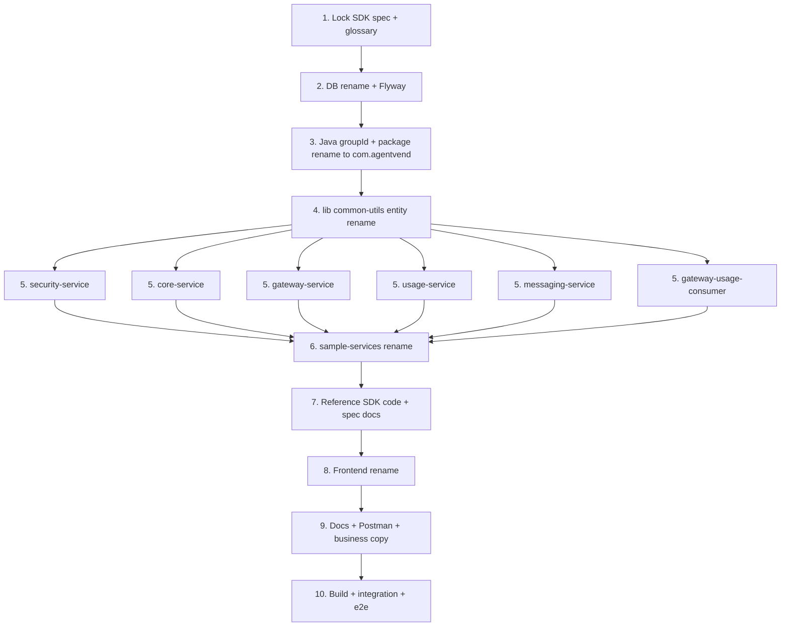

## Goals

- Replace product entity terminology end-to-end so the domain reads: `Developer` publishes `Services` (with `Products`), `Users` subscribe and invoke them.
- Keep the `AgentVend` brand intact: `AgentVendClient`, `X-AgentVend-*`, `AGENTVEND_*`, `agentvend.ai`, logos.
- Update [docs-sdk/MAIN-SDK-API-SPEC.md](docs-sdk/MAIN-SDK-API-SPEC.md) (including the change log) so the standalone `agentvend-sdk` repo can be brought into line in one pass.

## Naming Map (locked)

- Entities: `Service`->`Service`, `Developer`->`Developer`, `AgentUser`->`User`
- Identifiers: `serviceId`->`serviceId`, `service_id`->`service_id`, `developer_id`->`developer_id`, `ext_developer_id`->`ext_developer_id`, `service_product_id`->`service_product_id`, `service_endpoint_id`->`service_endpoint_id`, `is_developer_invocation`->`is_developer_invocation`
- Credentials concept: `ServiceKey`->`ServiceKey`, `serviceKey`->`serviceKey`, `serviceSecret`->`serviceSecret`
- HTTP paths: `/services`->`/services`, `/developers`->`/developers`, `/service-keys`->`/service-keys`, `/service-taxonomy`->`/service-taxonomy`, `/service/{serviceId}/endpoint/...`->`/service/{serviceId}/endpoint/...`, `/internal/services`->`/internal/services`
- Cognito role: `DEVELOPER`->`DEVELOPER` (User stays `USER`)
- SDK packages: `@agentvend/service-sdk`->`@agentvend/service-sdk`; `AgentVend.ServiceSdk`->`AgentVend.ServiceSdk`; `com.agentvend:service-sdk`->`com.agentvend:service-sdk`; `agentvend-service-sdk` (PyPI)->`agentvend-service-sdk`
- SDK methods/types: `validateServiceKey`->`validateServiceKey`, `ServiceKey*` types->`ServiceKey*`
- Top-level sample backends folder: `services/` -> `sample-services/`; `proxied-service`->`proxied-service`, `non-proxied-service`->`non-proxied-service`, `proxied-llm` and `proxied-mcp` keep names (not entity-named)
- Redis keys: `service:{serviceId}`->`service:{serviceId}`, `agent_key:v2:*`->`service_key:v2:*`, `subscription:{userId}:{serviceId}`->`subscription:{userId}:{serviceId}`, `service:secret:*`->`service:secret:*`, channels `agent_updates`/`agent_status_updates`->`service_updates`/`service_status_updates`
- Stripe metadata: `serviceId`->`serviceId`, `developer_id`->`developer_id`, `serviceProductId`->`serviceProductId`
- Spring Cloud Gateway route id `service-service` -> `service-routing` (avoid clash with new "service" word)
- Postgres database name: `agentvend_db` -> `agentvend_db` (legacy name from pre-rebrand "Service Hub"; aligns with the `AgentVend` brand). Postgres user `agentvendmaster` already brand-aligned, keep.
- Java group IDs and package roots: both `com.bugisiw, com.agentvend` and `com.agentvend` -> `com.agentvend`. This sits alongside the existing SDK namespace `com.agentvend.client.*` (no collision because the service subpackages are `core`, `gateway`, `usage`, `security`, `messaging`, `common`, `proxiedservice`, `nonproxiedservice`, `proxiedllm`, `proxiedmcp`, `e2e`, `loadtest`).
- Usage-service package consistency fix (rolled into the package rename pass): currently flat (`com.agentvend.controller`, `.service`, `.model`, `.config`) -> `com.agentvend.usage.*` so it matches the per-service convention used by every other service.
- Out of scope (kept as-is to limit blast radius): Copilot environment folder names (`copilot/environments/agent-hub-ppe/`, `agent-hub-prod/`) and the repo directory name `agent-hub` itself.

What stays unchanged: `AgentVendClient`, `AgentVendHeaders`, `AgentVendSdkConfig`, `AgentVendRequestVerifier`, `X-AgentVend-*` HTTP headers, `AGENTVEND_*` env vars, `agentvend.ai`, `AgentVendLogo_*.png`. After Phase 3 the service code also lives under `com.agentvend.*` - the SDK's `com.agentvend.client.*` namespace is unchanged.

## Execution Order

## Phase Detail

### Phase 1 - Spec + glossary lock

- Rewrite [docs-sdk/MAIN-SDK-API-SPEC.md](docs-sdk/MAIN-SDK-API-SPEC.md) to use new paths/fields/method names; add changelog entry "Hard rename Service->Service, Developer->Developer; no aliases".
- Add a one-page `docs/glossary.md` so future contributors can map old<->new during the transition window in branch.

### Phase 2 - DB rename + Flyway migrations

**2a. Database name rename (`agentvend_db` -> `agentvend_db`)**

Pre-prod: drop and recreate the dev/test databases rather than running `ALTER DATABASE ... RENAME` (cleaner; Flyway re-baselines from init scripts + migrations).

- Update Postgres init script [docker/postgres/init/01-create-database.sql](docker/postgres/init/01-create-database.sql) - change `CREATE DATABASE agentvend_db` to `agentvend_db`.
- Update `spring.datasource.url` in every `services/*/src/main/resources/application*.yml` (default + `-docker.yml` + `-ecs.yml`).
- Update Docker Compose files: [docker/docker-compose.infra.yml](docker/docker-compose.infra.yml), [docker/docker-compose.fullstack.yml](docker/docker-compose.fullstack.yml), [services/core-service/docker/docker-compose.yml](services/core-service/docker/docker-compose.yml).
- Update PowerShell + bash helpers: `scripts/env.ps1`, `scripts/load-test-data*.{ps1,sh,sql}`, `scripts/backfill-usernames.{ps1,sql}`, `scripts/update-developer-cognito-sub.{ps1,sql}`, `scripts/update-endpoint-urls-to-docker.ps1`, `test-db-connection.ps1`.
- Update e2e config: `e2e-tests/.env.example`, [e2e-tests/src/fixtures/test-config.ts](e2e-tests/src/fixtures/test-config.ts), `e2e-tests-java/local-env.ps1` and `remote-env.ps1`, [e2e-tests-java/src/test/java/com/bugisiw/marketplace/e2e/config/TestConfig.java](e2e-tests-java/src/test/java/com/bugisiw/marketplace/e2e/config/TestConfig.java).
- Update load tests: `load-tests/local-env.ps1`, `remote-env.ps1`, `LoadTestDataSeeder.java`, `LoadTestKeyChecker.java`, `LoadTestDbDiagnostic.java`.
- Update Copilot DB addons: rename `copilot/environments/agent-hub-ppe/addons/agenthub-db.yml` and `copilot/environments/agent-hub-prod/addons/agenthub-db.yml` to `agentvend-db.yml` and update DB name inside. (`copilot/environments/agentvend-prod/addons/agentvend-db.yml` already uses the new name.) Folder names of the environments themselves stay - only the addon file + content changes.
- Sweep readmes / docs that mention the DB name: [services/core-service/docker/README.md](services/core-service/docker/README.md), [docker/README.md](docker/README.md), [docs/project.md](docs/project.md), [e2e-tests/README.md](e2e-tests/README.md), [e2e-tests-java/README.md](e2e-tests-java/README.md), [load-tests/README.md](load-tests/README.md), [client/shell/README.md](client/shell/README.md), [docs/README.md](docs/README.md), [load-tests/user-files/README.txt](load-tests/user-files/README.txt), [IMPLEMENTATION_VERIFICATION.md](IMPLEMENTATION_VERIFICATION.md), [e2e-tests/SETUP_PRE_ONBOARDED.md](e2e-tests/SETUP_PRE_ONBOARDED.md).

**2b. Flyway migrations (table + column renames)**

- Add new Flyway migration files (do NOT edit historical `V*.sql`) under each service that owns tables:
  - core: `services/core-service/src/main/resources/db/migration/V<next>__rename_agent_to_service.sql`
  - usage: `services/usage-service/src/main/resources/db/migration/V<next>__rename_agent_to_service.sql`
  - messaging: `services/messaging-service/src/main/resources/db/migration/V<next>__rename_agent_columns.sql`
- Use `ALTER TABLE ... RENAME` for tables and `RENAME COLUMN` for columns; rename FK constraints and indexes that embed `service` in the constraint name.
- Update fresh-DB init scripts to match (run only on a fresh DB; Flyway handles existing databases): [services/core-service/postgres/init/01-create-billing-tables.sql](services/core-service/postgres/init/01-create-billing-tables.sql) and [docker/postgres/init/02-service-schema.sql](docker/postgres/init/02-service-schema.sql) (rename file to `02-service-schema.sql`), plus `docker/postgres/init/04-test-data.sql` and `05-developer-test-data.sql` (rename file to `05-developer-test-data.sql`).
- Tables to rename (core): `services`->`services`, `developer`->`developers`, `agent_keys`->`service_keys`, all `agent_product*`->`service_product*`, `agent_owner_earnings`->`developer_earnings`, taxonomy `agent_categories`/`agent_tags`/`agent_tag_synonyms`/`agent_category_tags`/`agent_agent_tags`->`service_categories`/`service_tags`/`service_tag_synonyms`/`service_category_tags`/`service_tag_assignments`, `agent_card_marketing_features`->`service_card_marketing_features`, `agent_profile*`->`service_profile*`.
- Tables to rename (usage): `agent_costs`->`service_costs`.
- Column renames: `service_id`->`service_id`, `developer_id`->`developer_id`, `service_product_id`->`service_product_id`, `service_endpoint_id`->`service_endpoint_id`, `ext_developer_id`->`ext_developer_id`, `is_developer_invocation`->`is_developer_invocation` (in `usage_logs` and other tables).

### Phase 3 - Java groupId + package rename to `com.agentvend`

Pure mechanical rename: no class names, methods, fields, or behaviour change. Goal: every Gradle module compiles green at the end of this phase, before the entity rename starts. Best done as one large IDE-driven refactor (IntelliJ "Rename Package") followed by a build-and-fix loop.

**3a. Gradle group IDs**

- Update `group = 'com.agentvend'` to `group = 'com.agentvend'` in every `build.gradle` listed by the survey: root [build.gradle](build.gradle) (if present), [lib/common-utils/build.gradle](lib/common-utils/build.gradle), all `services/*/build.gradle`, all `services/*/build.gradle`, [e2e-tests-java/build.gradle](e2e-tests-java/build.gradle), [load-tests/build.gradle](load-tests/build.gradle).

**3b. Source directory + package declarations**

- Rename source folders mechanically:
  - `services/<service>/src/{main,test,integration-test}/java/com/bugisiw/marketplace/` -> `.../java/com/agentvend/`
  - `services/core-service/src/{main,test,integration-test}/java/com/marketplace/core` -> `.../java/com/agentvend/core`
  - `lib/common-utils/src/main/java/com/bugisiw/marketplace/common` -> `.../com/agentvend/common`
  - `services/*/src/main/java/com/bugisiw/marketplace/<proxiedagent|proxiedllm|proxiedmcp|nonproxiedagent>` -> `.../com/agentvend/<same>` (the entity rename in Phase 6 then renames `proxiedagent` -> `proxiedservice` and `nonproxiedagent` -> `nonproxiedservice`).
  - `e2e-tests-java/src/test/java/com/bugisiw/marketplace/e2e` -> `.../com/agentvend/e2e`.
  - `load-tests/src/{main,gatling}/java/com/bugisiw/marketplace/loadtest` -> `.../com/agentvend/loadtest`.
- **Usage-service consistency fix** in this same pass: move `services/usage-service/src/{main,test,integration-test}/java/com/bugisiw/marketplace/{controller,service,model,config,...}` to `.../com/agentvend/usage/{controller,service,model,config,...}`. This brings it in line with `com.agentvend.gateway.*`, `com.agentvend.security.*`, `com.agentvend.messaging.*`. Spring Boot's main class will move to `com/agentvend/usage/UsageServiceApplication.java`, ensuring `@SpringBootApplication` package scanning still finds everything.
- Update every `package` and `import` statement accordingly. IntelliJ "Rename package" handles 99% of this; verify with `gradle compileJava` per module.

**3c. Spring config + YAML**

- Update [services/core-service/src/integration-test/java/com/marketplace/core/config/TestConfig.java](services/core-service/src/integration-test/java/com/marketplace/core/config/TestConfig.java): `@ComponentScan(basePackages = "com.agentvend.core")` -> `"com.agentvend.core"`.
- Sweep all `services/*/src/main/resources/application*.yml` and `src/{integration-test,test}/resources/application-test.yml` (~28 files) for `logging.level.com.bugisiw.*`, `logging.level.com.agentvend.*`, and any Spring property values that embed package strings; replace with `com.agentvend.*`.
- Check `spring.cloud.gateway` route filter args in [services/gateway-service/src/main/resources/application.yml](services/gateway-service/src/main/resources/application.yml) for any class-name strings.

**3d. Cross-references**

- Update `.cursor/rules/sdk-api-spec.mdc` paths if they encode old package roots.
- Update [postman/agent_hub.postman_collection.json](postman/agent_hub.postman_collection.json) if any sample requests reference class names (rare).
- Update [docs/sdk-callers-and-backends.md](docs/sdk-callers-and-backends.md), [docs/sdk-java-readme.md](docs/sdk-java-readme.md), [docs/sdk-repo-implementation-prompt.md](docs/sdk-repo-implementation-prompt.md) if they describe consumer-side imports referencing service package roots (the SDK's own `com.agentvend.client.*` is unchanged).
- Update logback / SLF4J `<logger name="com.bugisiw...">` if present (none seen so far - verify).

**3e. Build + verify**

- `gradle clean build` at root.
- Run integration tests for at least one service per package root just to confirm Spring component scanning still resolves all beans (`gradle :services:core-service:integrationTest`, `gradle :services:gateway-service:integrationTest`).

### Phase 4 - lib/common-utils entity rename

- Rename package `com.agentvend.common.model.service` -> `com.agentvend.common.model.service`.
- Rename classes: `Service`, `Developer`, `ServiceKey`, `ServiceProduct*`, `ServiceProfile*`, `ServiceNotFoundException`, `ServiceRegistrationRequest`, `RegisterRequest` (`userType` constants), [lib/common-utils/src/main/java/com/agentvend/common/cache/SubscriptionCacheKeys.java](lib/common-utils/src/main/java/com/agentvend/common/cache/SubscriptionCacheKeys.java), [lib/common-utils/src/main/java/com/agentvend/common/util/GatewayHmacUserContext.java](lib/common-utils/src/main/java/com/agentvend/common/util/GatewayHmacUserContext.java) - keep `AgentVend` brand strings here, rename only entity references (`serviceSecret`->`serviceSecret`).
- `lib/common-utils/src/main/java/com/agentvend/common/exception/ServiceNotFoundException.java` -> `ServiceNotFoundException.java`.
- Rebuild: `gradle :lib:common-utils:build`.

### Phase 5 - Microservices entity rename (per service)

For each service, rename Java packages, classes, JPA `@Entity`/`@Table` mappings (must match Phase 2 schema), `@RequestMapping` paths, DTO fields, and Spring `@PreAuthorize`/`SecurityConfig` rules. All file paths below use the new `com.agentvend.*` roots from Phase 3.

- security-service:
  - [services/security-service/src/main/java/com/agentvend/security/service/AuthService.java](services/security-service/src/main/java/com/agentvend/security/service/AuthService.java): `userType` allowed values `DEVELOPER`/`USER` -> `DEVELOPER`/`USER`; Cognito group strings.
  - Update Cognito group provisioning scripts under `services/security-service/scripts/` and `services/security-service/documentation/RBAC-README.md`.
- core-service:
  - Package rename: `com.agentvend.core.service.*` -> `com.agentvend.core.service.*` (note: module name `core-service` stays).
  - Controllers: `ServiceController`->`ServiceController` (`/services`->`/services`), `DeveloperController`->`DeveloperController` (`/developers`->`/developers`), `ServiceKeyController`->`ServiceKeyController` (`/service-keys`->`/service-keys`), `ServiceProductController`->`ServiceProductController`, `ServiceProfileController`->`ServiceProfileController`, `ServiceTaxonomyController`->`ServiceTaxonomyController`, `InternalServiceController`->`InternalServiceController` (`/internal/services`->`/internal/services`), `OpenApiImportController` paths.
  - Billing: [services/core-service/src/main/java/com/agentvend/core/billing/controller/CouponController.java](services/core-service/src/main/java/com/agentvend/core/billing/controller/CouponController.java) base path `/services`->`/services`; [services/core-service/src/main/java/com/agentvend/core/billing/controller/BillingController.java](services/core-service/src/main/java/com/agentvend/core/billing/controller/BillingController.java) `/subscriptions/service/{serviceId}`->`/subscriptions/service/{serviceId}`, `/developer/refunds`->`/developer/refunds`; `TransactionController` `/service/{serviceId}`->`/service/{serviceId}`.
  - Stripe metadata in [services/core-service/src/main/java/com/agentvend/core/billing/service/StripeService.java](services/core-service/src/main/java/com/agentvend/core/billing/service/StripeService.java) and [services/core-service/src/main/java/com/agentvend/core/billing/service/TransactionService.java](services/core-service/src/main/java/com/agentvend/core/billing/service/TransactionService.java): keys `serviceId`/`developer_id`/`serviceProductId` -> `serviceId`/`developer_id`/`serviceProductId`.
  - Webhook reconciliation: ensure metadata reads new keys (no fallback - pre-prod).
  - SecurityConfig + `@PreAuthorize`: `hasRole('DEVELOPER')` -> `hasRole('DEVELOPER')`; URL matchers.
- gateway-service:
  - Controller path `/service/{serviceId}/endpoint/{endpointId}/invoke[/async]` -> `/service/{serviceId}/endpoint/{endpointId}/invoke[/async]`.
  - Classes: `ServiceInvocationService`->`ServiceInvocationService`, `ServiceStreamingInvocationService`, `ServiceKeyValidationService`->`ServiceKeyValidationService`, `ServiceReportedStreamUnitsParser`, `InvokeContextServiceDto`->`InvokeContextServiceDto`.
  - Redis cache key prefixes: `service:`->`service:`, `agent_key:v2:`->`service_key:v2:`, channel name in [services/gateway-service/src/main/resources/application.yml](services/gateway-service/src/main/resources/application.yml) and `application-ecs.yml`.
  - Spring Cloud Gateway route id `service-service` -> `service-routing`; `Path=/api/services/`** -> `Path=/api/services/`**.
- usage-service (already at `com.agentvend.usage.*` after Phase 3):
  - Controller path `/services/{serviceId}/traffic`->`/services/{serviceId}/traffic`, `/developers/me/**`->`/developers/me/**`, `/quota/{userId}/{serviceId}`->`/quota/{userId}/{serviceId}`.
  - Classes: `ServiceTrafficResponse`->`ServiceTrafficResponse`, `DeveloperPortfolioSummaryResponse`->`DeveloperPortfolioSummaryResponse`, inner `ServiceInfo`->`ServiceInfo`, `AbstractUsageTracker` cache key `service:secret:`->`service:secret:`.
- messaging-service: rename `ServiceStatusSubscriber`/`ServiceRetiringRequest` and notification template wording; update Redis channel names.
- gateway-usage-consumer: rename payload field `serviceId` and any Stripe metadata keys read.

### Phase 6 - sample-services (top-level)

- Rename folder `services/` -> `sample-services/`; rename subfolders `proxied-service`->`proxied-service`, `non-proxied-service`->`non-proxied-service` (`proxied-llm`, `proxied-mcp` keep names).
- Update `settings.gradle`, root `build.gradle`, and Docker Compose files (`docker/docker-compose.e2e-services.yml` etc.) to reference new paths/module names.
- Internal Java packages: `com.agentvend.proxiedagent` -> `com.agentvend.proxiedservice`, `com.agentvend.nonproxiedagent` -> `com.agentvend.nonproxiedservice`.
- Update READMEs in each subfolder.

### Phase 7 - Reference SDK code + SDK READMEs

- Java reference SDK under `client/java/` (and any companion under `e2e-test-sdk/`): rename classes (`ServiceKeyValidationClient`->`ServiceKeyValidationClient`, `AgentVendRequestVerifier` keeps brand) and methods (`validateServiceKey`->`validateServiceKey`, `reportUsage` keeps name; argument `serviceId`/`serviceSecret` -> `serviceId`/`serviceSecret`).
- Update [docs-sdk/README-js.md](docs-sdk/README-js.md), [docs-sdk/README-dotnet.md](docs-sdk/README-dotnet.md), [docs-sdk/README-java.md](docs-sdk/README-java.md), [docs-sdk/README-python.md](docs-sdk/README-python.md), [docs-sdk/MAIN-SDK-API-SPEC.md](docs-sdk/MAIN-SDK-API-SPEC.md) (any remaining text after Phase 1).
- Update [docs/sdk-callers-and-backends.md](docs/sdk-callers-and-backends.md), [docs/sdk-java-readme.md](docs/sdk-java-readme.md), [docs/sdk-repo-implementation-prompt.md](docs/sdk-repo-implementation-prompt.md), [docs/sdk-repo-project-context.md](docs/sdk-repo-project-context.md) so they describe new package names and method signatures for the agentvend-sdk repo to mirror.
- Note in plan: actual publishing of `@agentvend/service-sdk` etc. happens in the separate `agentvend-sdk` repo (out of scope here); this phase only fixes the contract docs and the reference Java client used by tests in this repo.

### Phase 8 - Frontend

- Routes: rename folders under [frontend/app/](frontend/app/): `services/`->`services/`, `developers/`->`developers/`, `service-keys/`->`service-keys/`, `(auth)/register/developer/`->`(auth)/register/developer/`. Update `frontend/middleware.ts` `protectedRoutes`.
- Components: `frontend/components/services/` -> `frontend/components/services/`; `frontend/components/service-keys/` -> `frontend/components/service-keys/`; rename `ServiceCard`->`ServiceCard`, `ServiceWorkspaceLayout`->`ServiceWorkspaceLayout`, `RegisterServiceWizard`->`RegisterServiceWizard`, `DeveloperStatusToggles`->`DeveloperStatusToggles`, `CreateServiceKeyModal`->`CreateServiceKeyModal`; also `components/products/ServiceProductListCard.tsx`, `components/billing/ServiceSubscriptionsList.tsx`, `components/landing/FeaturedServicesSection.tsx`.
- API clients: [frontend/lib/api/services.ts](frontend/lib/api/services.ts) -> `services.ts`, [frontend/lib/api/developers.ts](frontend/lib/api/developers.ts) -> `developers.ts`, [frontend/lib/api/service-keys.ts](frontend/lib/api/service-keys.ts) -> `service-keys.ts`, update [frontend/lib/api/index.ts](frontend/lib/api/index.ts) re-exports.
- Types: [frontend/lib/types/service.ts](frontend/lib/types/service.ts) -> `service.ts`, `developer.ts` -> `developer.ts`, `service-key.ts` -> `service-key.ts`, `service-profile.ts` -> `service-profile.ts`. Update fields in `billing.ts`, `usage.ts`, `messaging.ts`.
- Utils: rename `lib/utils/service-workspace*.ts`, `service-key-storage.ts`, `service-card-branding.ts`, `services-page-filter-storage.ts`, plus tests; sweep substring `service` in all `lib/utils/*.ts` and `*.test.ts`.
- Constants: [frontend/lib/utils/constants.ts](frontend/lib/utils/constants.ts) - rename `API_ENDPOINTS.CORE.AGENTS`->`SERVICES`, `AGENT_OWNERS`->`DEVELOPERS`, `AGENT_KEYS`->`SERVICE_KEYS`, `TAXONOMY` paths, `GATEWAY` invoke paths, `FRONTEND_ROUTES`, `USER_ROLES.DEVELOPER`->`DEVELOPER`.
- Visible copy: header nav "Services"->"Services", "My Services"->"My Services", "Developer"->"Developer", "Become an Owner"->"Become a Developer", role labels in [frontend/components/layout/Header.tsx](frontend/components/layout/Header.tsx). Landing copy in [frontend/app/page.tsx](frontend/app/page.tsx), [frontend/components/landing/ProductFeaturesSection.tsx](frontend/components/landing/ProductFeaturesSection.tsx), `FeaturedServicesSection`->`FeaturedServicesSection`.
- Frontend tests: rename matching `*.test.ts` files and update assertion strings.

### Phase 9 - Docs + Postman + business copy

- Sweep all `docs/*.md` (deduplicated list from survey, ~30 files) for "developer", "user", "Service" entity references. Update to "developer", "user", "Service".
- [businessContext.txt](businessContext.txt): replace product narrative "Services" -> "Services" where it refers to the entity (keep "AI Services" as a category/example only where natural).
- [postman/agent_hub.postman_collection.json](postman/agent_hub.postman_collection.json): rename to `postman/agentvend.postman_collection.json`; update all `/services`, `/developers`, `/service/:serviceId/endpoint/...`, `/billing/subscriptions/service/:serviceId`, body fields. Add `/service-keys` paths if currently missing.
- [docs/sellingpointsandfeatures.md](docs/sellingpointsandfeatures.md), [docs/use-cases.md](docs/use-cases.md), [docs/project.md](docs/project.md), [docs/INTER_SERVICE_COMMUNICATION.md](docs/INTER_SERVICE_COMMUNICATION.md), [docs/legal.md](docs/legal.md): targeted rewrites.
- Frontend public docs under [frontend/app/docs/](frontend/app/docs/): rewrite the ~16 pages flagged in survey, including `concepts/services-and-endpoints/page.tsx` (route segment too: `concepts/services-and-endpoints` -> `concepts/services-and-endpoints`).

### Phase 10 - Verification

- `gradle clean build` at repo root (per workspace rules - use `gradle`, not `gradlew`).
- Run integration tests per service (`gradle :services:core-service:integrationTest`, etc.).
- Run this test from the e2e Java suite (`e2e-tests-java`) with a fresh DB so Flyway runs cleanly, using the following parameters:
  - **.\gradlew.bat test -DTEST_DEVELOPER_EMAIL=**"[test-developer-1776889791564@example.com](mailto:test-developer-1776889791564@example.com)" **-DTEST_DEVELOPER_PASSWORD="TestPassword123!" -DPLAYWRIGHT_HEADED=true -DINVOCATION_DELAY_MS=5 --tests "com.agentvend.e2e.SubscriptionMonthlyProxiedOverageTest"**
  - before you run this test you will need to redeploy updated services - do this using the @manage-docker-services script: .\scripts\manage-docker-services.ps1 -RebuildCoreservice -XTests
- Manual smoke: register developer (Cognito group `DEVELOPER`), create service, create product, subscribe as user, invoke via gateway, verify webhook flows pull new Stripe metadata keys, verify Redis cache keys.
- Confirm SDK contract by running `e2e-test-sdk/run-sdk-contract-e2e.ps1` once the agentvend-sdk repo is also updated (out-of-repo step; flag for follow-up).

## Risks / Notes

- Cognito group rename `DEVELOPER` -> `DEVELOPER` requires recreating groups in dev/test Cognito user pools and re-adding any seeded test users.  `<- I've added the DEVELOPER` `group to Cognito already`
- Stripe metadata key change is a hard break for any in-flight Stripe objects in dev sandbox - safe to wipe dev test data.
- Spring Cloud Gateway route id `service-service` colliding with the new "service" word means we rename it to `service-routing` to avoid ambiguity.
- Keep `AgentVend` brand tokens unchanged everywhere - reviewers should explicitly check headers, env vars, class prefixes, logos.
- DB rename `agentvend_db` -> `agentvend_db`: dev/test DBs will be dropped and recreated from init scripts and Flyway migrations (pre-prod, no data to preserve). For any deployed PPE/PROD environment, this becomes a separate cutover (RDS rename, Copilot redeploy) - not in this PR.
- Copilot environment folder names, and the repo directory `agent-hub` stay to limit infra disruption.

## Services to rebuild after the rename

All Gradle modules: `lib:common-utils`, `services:core-service`, `services:gateway-service`, `services:usage-service`, `services:security-service`, `services:messaging-service`, `services:gateway-usage-consumer`, all renamed `sample-services:`*. Frontend `npm run build` in [frontend/](frontend/).

## Acceptance Criteria

- Repo-wide ripgrep for the entity tokens (excluding the `AgentVend` brand) returns zero meaningful matches for any of:
  - `\bService\b`
  - `\bagentId\b`
  - `\bDeveloper\b`
  - `\bagent_owner\b`
  - `\bServiceKey\b`
  - `\bagent-keys\b`
  - `\bAGENT_OWNER\b`
  - `\bServiceUser\b`
  - `\bagentvend_db\b`
  - `\bcom\.bugisiw\.marketplace\b`
  - `\bcom\.marketplace\b`
  Allowed exceptions: historical Flyway `V*.sql` scripts, this plan file, `docs/glossary.md`, and the `.cursor/plans/`* archive.
- All Gradle modules build clean.
- All integration test suites pass.
- All e2e suites (Playwright + Java) pass with a fresh DB.
- Frontend builds and renders new routes; no broken links from old routes.
- [docs-sdk/MAIN-SDK-API-SPEC.md](docs-sdk/MAIN-SDK-API-SPEC.md) reflects all renamed paths/fields/method names with a changelog entry.
- Postman collection imports cleanly and all sample requests use new paths.

