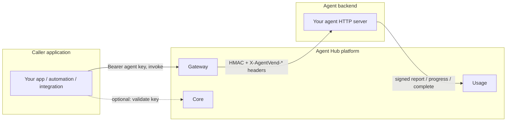
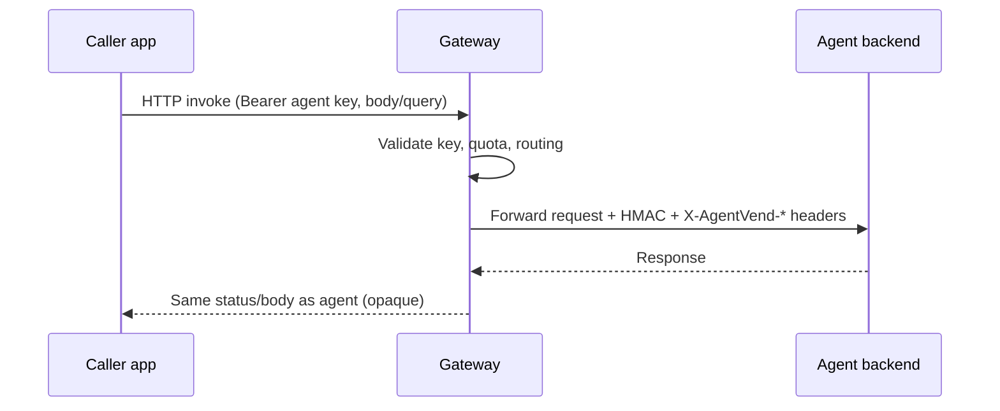
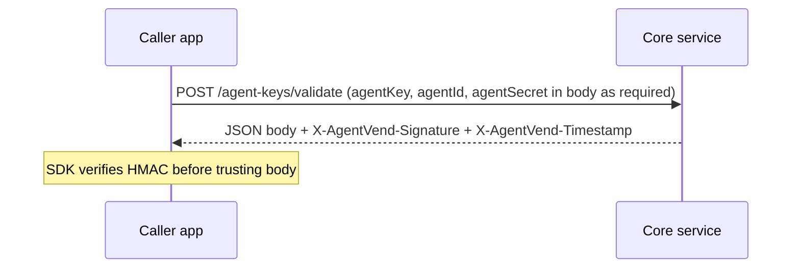
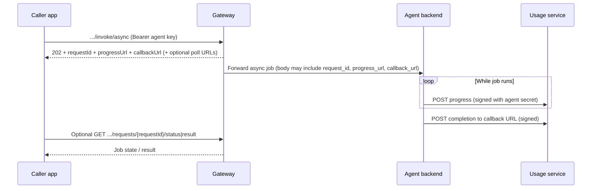
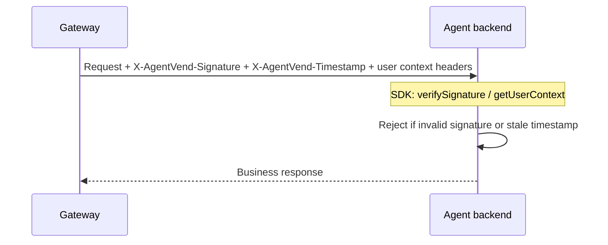
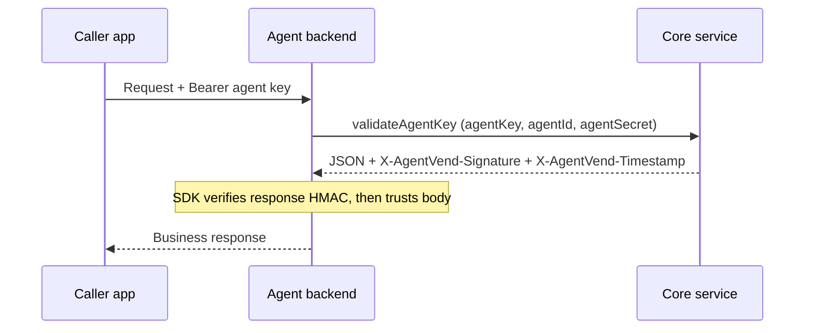
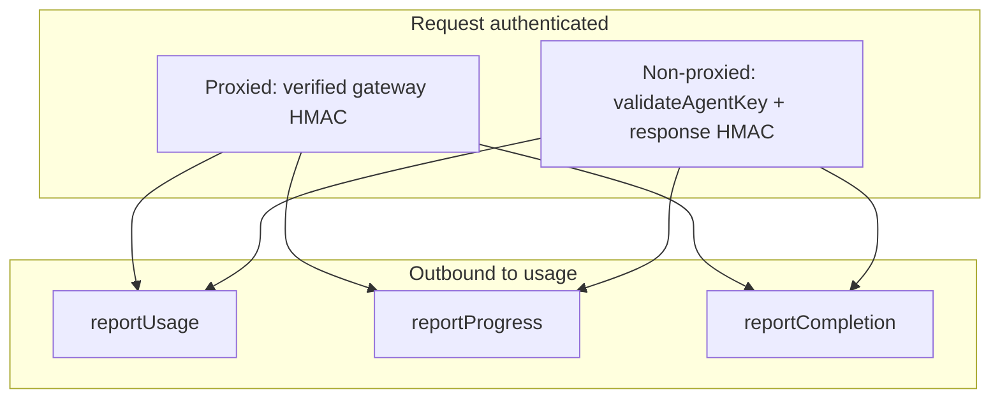
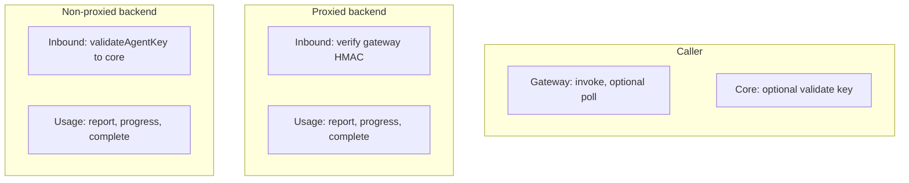

# AgentVend SDK: Callers vs Agent Backends

This document explains **how the AgentVend SDK is used** in the two main integration roles: **callers** (clients that invoke agents) and **agent backends** (your HTTP server, either **proxied** via the gateway or **non-proxied** and reached directly). It complements the normative HTTP details in **[sdk-api-spec.md](./sdk-api-spec.md)** and the SDK monorepo orientation in **[sdk-repo-project-context.md](./sdk-repo-project-context.md)**.

**Related docs**

| Document | Purpose |
|----------|---------|
| [sdk-api-spec.md](./sdk-api-spec.md) | Exact URLs, headers, bodies, HMAC rules for SDK implementers |
| [sdk-repo-project-context.md](./sdk-repo-project-context.md) | What lives in the separate SDK repo and how it relates to Agent Hub |

There is **no other doc** in this folder dedicated solely to caller vs backend *usage*; those files focus on API contracts and repository layout.

**Base URLs:** SDKs do not embed production hostnames. Callers and backends configure Gateway, Core, and Usage base URLs (and path prefixes per deployment). Async flows should use the full `progressUrl` / `callbackUrl` values returned by the platform. See [api-overview.md](./api-overview.md) and [sdk-api-spec.md](./sdk-api-spec.md).

**Unified HTTP entry point:** In Java, Python, JavaScript/TypeScript, Rust (`http` feature), and .NET, look for `AgentVendClient` (or `AgentVendClient::try_new` / `createAgentVendClient`-style APIs) to configure one origin from `AGENTVEND_API_URL` (and optional split bases / path prefixes) instead of wiring each low-level client by hand.

---

## 1. Two roles in one platform

- **Caller** — Sits **outside** the agent’s server. For **proxied** agents it uses an **agent API key** against the **gateway** invoke URL (and may optionally call **core** to validate a key). For **non-proxied** agents it typically sends **`Authorization: Bearer <agentKey>`** directly to the agent’s public URL. Callers never see gateway HMAC headers.
- **Agent backend** — The HTTP server that implements the agent. **Proxied** backends receive **gateway-signed** requests (`X-AgentVend-Signature`, user context headers). **Non-proxied** backends receive **Bearer** keys and must **validate** them with **core**. Both modes typically call the **usage** service to report consumption and (for async jobs) progress and completion.

### Proxied vs non-proxied (backends)

| | **Proxied** | **Non-proxied** |
|---|-------------|-----------------|
| **Caller’s entry URL** | Gateway invoke URL | Agent owner’s own HTTP base URL |
| **Who validates the agent key first** | Gateway | Your backend (via core `validate`) |
| **Inbound cryptographic check on your server** | Verify **gateway HMAC** with **agent secret** | **None** from gateway; use **`validateAgentKey`** + response HMAC to core |
| **Usage / progress / completion** | Signed POSTs to **usage** (agent secret) | Same |

The published SDK exposes one logical surface; **which calls you use depends on role (caller vs backend) and proxied vs non-proxied**.

---

## 2. Callers: what they do and why use the SDK

A caller’s job is to **invoke** an agent (sync or async): for **proxied** agents that means the **gateway** invoke URL; for **non-proxied** agents it means the **agent’s own** URL. Callers may optionally **validate** an agent key via **core** first. For **proxied** async flows they may **poll** job status or result on the gateway.

### 2.1 Sync invoke (proxied path via gateway)

For synchronous **proxied** invoke, the caller sends **`Authorization: Bearer <agentKey>`** to the gateway. No HMAC is required on the caller’s side for this request.

**SDK value for callers (sync)**

- Mainly to get quota info by calling validate key and to validate the response HMAC using SDK.
- Correct URL shape and path prefixes (local vs ECS-style bases) — see [sdk-api-spec.md](./sdk-api-spec.md) §1.
- Typed helpers and shared conventions (e.g. parsing async body into object - requestId, progressUrlm callbackUrl); invoke alone can also be done with any HTTP client.

### 2.2 Optional: validate agent key and get quota info

Callers that need **plan, quota, or validity** before invoking (or without going through the gateway) call **core** `POST .../agent-keys/validate`. The response is **HMAC-signed**; clients that care about tampering **must** verify the signature using the **agent secret** (same rules as in [sdk-api-spec.md](./sdk-api-spec.md) §2).

**SDK value:** Implements **response HMAC verification** (canonical string, constant-time compare), which is easy to get wrong when hand-rolled.

### 2.3 Async invoke and polling (proxied / gateway)

For **proxied** agents, async invoke on the gateway returns **202** with `requestId`, and URLs for **progress** (usage) and **callback** (completion), plus gateway URLs the **caller** may use to poll **status** and **result** ([sdk-api-spec.md](./sdk-api-spec.md) §1.2–1.4). **Non-proxied** async patterns depend on how the agent owner exposes their API; usage reporting from the backend still uses the same signed **usage** endpoints when applicable.

**SDK value:** Encapsulates async response handling and optional polling paths aligned with the spec.

### 2.4 Caller-facing SDK capabilities (summary)

| Capability | Service | Caller needs SDK? |
|------------|---------|-------------------|
| Invoke sync/async | Gateway | **SDK not required** — any HTTP client + `Bearer` to the **gateway invoke URL** is standard; SDK only for convenience (prefixes, async helpers) |
| Validate key + verify response HMAC | Core | **Strongly recommended** if you call validate yourself (same whether you later invoke via gateway or not) |
| Poll job status/result | Gateway | Optional SDK convenience |

---

## 3. Agent backends: what they do and why use the SDK

Backends are either **proxied** (behind the gateway) or **non-proxied** (clients hit your URL directly). The SDK calls you rely on for **inbound trust** differ; **outbound** usage reporting is the same in both cases ([sdk-api-spec.md](./sdk-api-spec.md) §3).

### 3.1 Inbound: proxied agents (gateway-signed requests)

The gateway validates the caller’s agent key, then forwards to your URL with **HMAC** and **`X-AgentVend-*`** headers. You **must** verify that signature with the **agent secret** before trusting the body or headers ([sdk-api-spec.md](./sdk-api-spec.md) §4).

**SDK value:** **`verifySignature`** / **`getUserContext`** implement the canonical string and header rules. You typically **do not** need **`validateAgentKey`** on every request here because the gateway already validated the key.

### 3.2 Inbound: non-proxied agents (direct Bearer key)

Callers send **`Authorization: Bearer <agentKey>`** to **your** server. There is **no** gateway HMAC. To obtain **user id, plan, quota, subscription** and to reject bad keys, the backend calls **core** **`POST .../agent-keys/validate`** and **must verify** the response HMAC with the **agent secret** ([sdk-api-spec.md](./sdk-api-spec.md) §2). A reference pattern lives under `agents/non-proxied-agent` in this repo.

**SDK value:** **`validateAgentKey`** (with response HMAC verification) is the **primary** inbound trust mechanism for non-proxied agents. **`verifySignature`** for gateway HMAC does **not** apply.

### 3.3 Outbound: usage, progress, and completion (both modes)

After the request is authenticated (**proxied:** verified gateway HMAC; **non-proxied:** validated key via core), backends report **usage** and, for async work, **progress** and **completion** to the **usage** service. All use **HMAC** over `body + timestamp` with the **agent secret** ([sdk-api-spec.md](./sdk-api-spec.md) §3 and §6).

**SDK value:** **`reportUsage`**, **`reportProgress`**, **`reportCompletion`** produce correctly signed requests and correct URL usage (including full `progress_url` / `callback_url` when the gateway forwarded them for async jobs).

### 3.4 Backend-facing SDK capabilities (summary)

| SDK capability | Proxied agent (gateway in front) | Non-proxied agent (direct to your URL) |
|----------------|----------------------------------|----------------------------------------|
| **verifySignature** / **getUserContext** (gateway HMAC) | **Yes** — required for inbound trust | **No** — gateway does not sign these requests |
| **validateAgentKey** (+ verify core response HMAC) | **Optional** — e.g. double-check, tooling, or custom flows; not required for normal gateway-forwarded traffic | **Yes** — typical for every request (or validated session/cache you define) |
| **reportUsage** / **reportProgress** / **reportCompletion** | **Yes** — when your integration reports to usage | **Yes** — same |

---

## 4. Side-by-side: which services each role talks to

Only **gateway**, **core**, and **usage** are in scope for the public SDK ([sdk-repo-project-context.md](./sdk-repo-project-context.md)). Security-service user JWT flows are **not** part of this SDK surface for agent key / HMAC integration.

| Service | Caller | Proxied backend | Non-proxied backend |
|---------|--------|-----------------|---------------------|
| **Gateway** | Primary (invoke; optional status/result) | Inbound only (gateway calls your URL) | Not used for invoke |
| **Core** | Optional (validate key + HMAC verify response) | Optional `validate` (not required for normal gateway traffic) | **Required** for `validateAgentKey` inbound trust |
| **Usage** | Caller does not sign to usage | Report / progress / completion (agent secret) | Same |

---

## 5. Mental model: secrets and keys

- **Agent API key** — For **proxied** agents, the caller sends it as `Authorization: Bearer ...` to the **gateway**. For **non-proxied** agents, the caller typically sends the same header to **your** backend; your backend then validates it with **core**.
- **Agent secret** — Held by the **agent backend** (and optionally by trusted **caller** code that calls **validate** and must verify response HMAC). Used to **verify** gateway HMAC (**proxied**), to **verify** core validate responses (**non-proxied** and any validate caller), and to **sign** outbound usage/progress/completion requests to **usage**.

Never expose the agent secret in browser-only or untrusted caller code; for pure public clients, use invoke-only flows and keep secrets on servers you control.

---

## 6. Implementations and source of truth

- **Normative HTTP and HMAC:** [sdk-api-spec.md](./sdk-api-spec.md).
- **Java reference** in this monorepo: `client/java` (see its README). Published multi-language SDKs live in the separate **agentvend-sdk** repository described in [sdk-repo-project-context.md](./sdk-repo-project-context.md).

When diagrams in this doc differ in detail from the spec, **the spec wins**.
